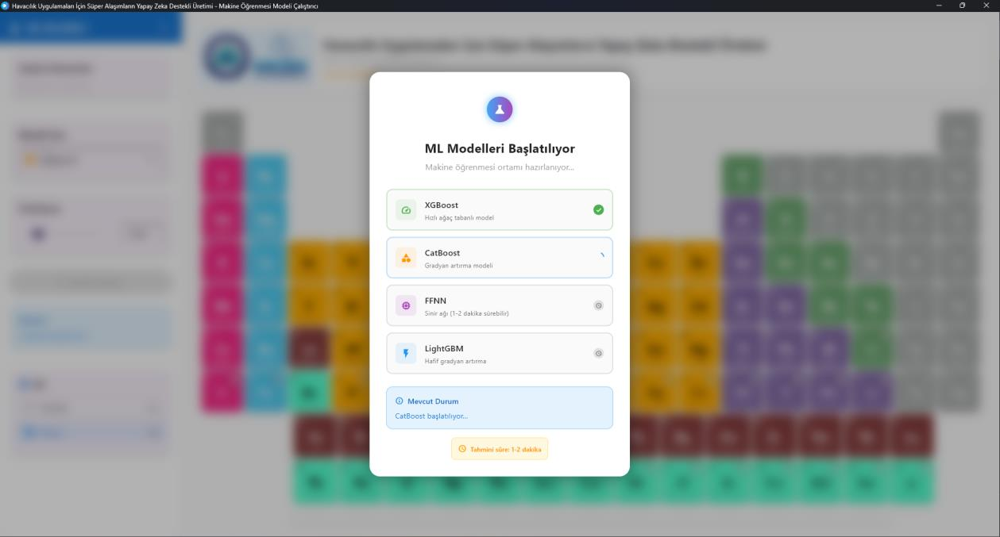
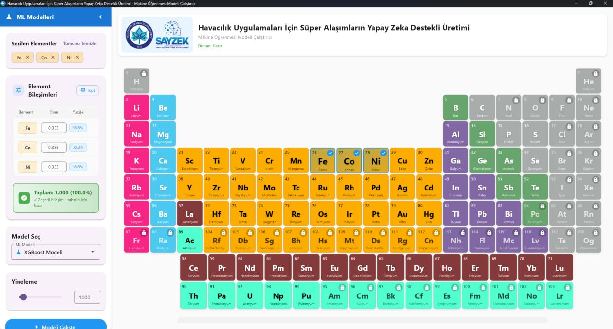
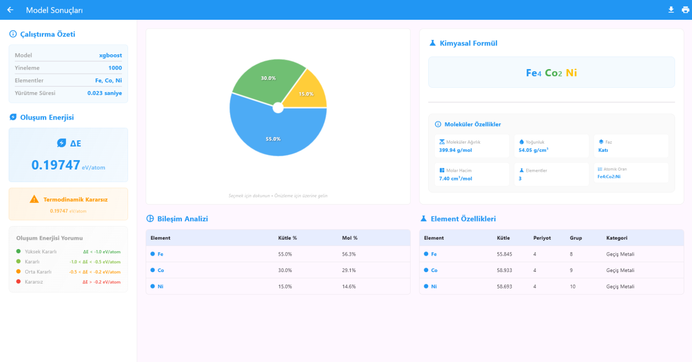

# CompositionPilot

A Windows desktop application built with Flutter that predicts **Delta E (formation energy)** for alloy compositions using multiple machine learning models. It helps materials scientists discover optimal element compositions by running ML-powered predictions locally on your machine.


---

## Features

- **5 ML Models** running simultaneously as independent Flask microservices
- **Two prediction modes**:
  - **Specific Mode** — Provide exact element fractions, get instant Delta E prediction
  - **Random Search Mode** — Select elements, let the app find the optimal composition automatically
- **Real-time health monitoring** for all model services
- **PDF export** support for prediction results
- **No internet required** — everything runs locally

---

## Screenshots

### Startup — ML Models Loading

> On launch, the app initializes all 5 ML model services in the background. A startup dialog shows each model's loading status in real time.

### Element & Composition Selection

> The main interface presents a full interactive periodic table. Select elements by clicking on them, then set the composition fraction for each one or choose random search mode.

### Prediction Results

> The results page displays the predicted Delta E (formation energy) value in eV/atom, thermodynamic stability classification, chemical formula, composition pie chart, molecular properties (molecular weight, density, molar volume), and detailed element properties.

---

## Disclaimer

This project was built using **publicly available open-source datasets** for research and proof-of-concept purposes.

- Prediction results **may not be 100% accurate**. The primary goal of this project is to demonstrate the feasibility and core logic of using machine learning models for alloy composition optimization.
- The datasets used were the best openly available options at the time of development. Due to their limited scope and resolution, some predictions may deviate from experimentally measured values.
- For production-grade accuracy and reliability, it is recommended to retrain the models with **higher-quality, closed-source, or domain-specific datasets** that offer greater coverage, precision, and material diversity.

> This tool is intended for research exploration and educational purposes. Always validate critical results with experimental data or established simulation methods (e.g., DFT calculations).

---

## ML Models

| Model | Port | Framework | Description |
|-------|------|-----------|-------------|
| XGBoost | 5000 | xgboost | Gradient boosted trees |
| CatBoost | 5001 | catboost | Gradient boosting with categorical features |
| FFNN | 5002 | TensorFlow/Keras | Feed-Forward Neural Network |
| LightGBM | 5003 | lightgbm | Light Gradient Boosting Machine |
| FCNN | 5004 | TensorFlow/Keras | Fully Connected Neural Network with Lasso feature selection |

All models expose a consistent REST API:
- `GET /health` — Service health check
- `POST /predict` — Run a prediction

---

## Requirements

### System
- Windows 10 / 11 (64-bit)
- Python 3.7 or higher (3.11+ recommended)
- ~2 GB free disk space
- ~2 GB RAM (TensorFlow models require ~500 MB each)

### Python Dependencies
Each model manages its own isolated virtual environment via its `setup.py` script. No global installs needed.

---

## Installation & Setup

### Step 1 — Clone the Repository

```bash
git clone https://github.com/mmustafaozgur/CompositionPilot.git
cd CompositionPilot
```

### Step 2 — Set Up ML Model Services

Each model needs a one-time setup to create its Python virtual environment and install dependencies.

```bash
# Set up XGBoost (Port 5000)
cd data/flutter_assets/lib/ml_models/xgboost
python setup.py
cd ../..

# Set up CatBoost (Port 5001)
cd catboost
python setup.py
cd ..

# Set up FFNN - Feed-Forward Neural Network (Port 5002)
cd ffnn
python setup.py
cd ..

# Set up LightGBM (Port 5003)
cd lightgbm
python setup.py
cd ..

# Set up FCNN - Fully Connected Neural Network (Port 5004)
cd fcnn
python setup.py
cd ..
```

> **Note:** FFNN requires `tf-nightly` for Python 3.13 compatibility. For Python 3.11/3.12, standard `tensorflow` is used automatically.

### Step 3 — Run the Application

Double-click `ml_model_runner.exe` or run it from the terminal:

```bash
ml_model_runner.exe
```

The app will automatically start all model services in the background on their respective ports.

---

## Usage

### Specific Composition Prediction

1. Select a model from the sidebar
2. Choose the elements you want to include
3. Set the fraction for each element (must sum to 1.0)
4. Click **Predict** to get the Delta E value instantly

### Random Composition Search

1. Select a model from the sidebar
2. Choose the elements to include in the search
3. Set the number of iterations (default: 1000)
4. Click **Search** — the app samples random compositions and finds the one with the lowest Delta E

---

## Project Structure

```
CompositionPilot/
├── ml_model_runner.exe              # Main application executable
├── flutter_windows.dll              # Flutter engine
├── pdfium.dll                       # PDF export support
├── *_plugin.dll                     # Window manager, printing plugins
└── data/
    ├── app.so                       # Compiled Dart application code
    └── flutter_assets/
        ├── assets/                  # App icons and logos
        └── lib/ml_models/
            ├── xgboost/             # XGBoost model + Flask service
            ├── catboost/            # CatBoost model + Flask service
            ├── ffnn/                # FFNN model + Flask service
            ├── lightgbm/            # LightGBM model + Flask service
            └── fcnn/                # FCNN model + Flask service
```

Each model directory contains:
- `*_service.py` — Flask REST API server
- `setup.py` — Automated dependency installer
- `*.joblib` / `*.h5` / `*.json` — Pre-trained model files
- `*_Random.py` — Standalone random search script
- `*_Spesific.py` — Standalone specific prediction script
- `*_Model_Egitimi.ipynb` — Training notebook (where available)

---

## API Reference

All model services follow the same API contract.

### Health Check

```http
GET http://localhost:<port>/health
```

```json
{
  "status": "healthy",
  "service": "XGBoost ML Service",
  "model_loaded": true,
  "features_count": 89
}
```

### Predict

```http
POST http://localhost:<port>/predict
Content-Type: application/json
```

**Specific composition mode:**
```json
{
  "elements": ["Fe", "Ni", "Al"],
  "compositions": {
    "Fe": 0.5,
    "Ni": 0.3,
    "Al": 0.2
  }
}
```

**Random search mode:**
```json
{
  "elements": ["Fe", "Ni", "Al"],
  "iterations": 1000
}
```

**Response:**
```json
{
  "delta_e": -1.234,
  "composition": {
    "Fe": 0.5,
    "Ni": 0.3,
    "Al": 0.2
  },
  "total": 1.0
}
```

---

## Troubleshooting

### A model service fails to start

```bash
# Check if the port is already in use (example for port 5001)
netstat -ano | findstr :5001

# Kill the process using that port
taskkill /F /PID <PID>
```

### TensorFlow not found (FFNN / FCNN)

```bash
# For Python 3.13
pip install tf-nightly

# For Python 3.11 / 3.12
pip install tensorflow
```

### Protobuf version conflict

```bash
pip install "protobuf<5"
```

### Model file not found

Make sure all `.h5`, `.joblib`, and `.json` model files exist in their respective directories. They are included in the repository but may not download correctly if Git LFS is not set up.

---

## Performance Notes

| Model | Startup Time | Prediction Time | Memory Usage |
|-------|-------------|-----------------|--------------|
| XGBoost | ~3s | <5ms | ~100 MB |
| CatBoost | ~5s | <10ms | ~200 MB |
| FFNN | 15-30s | 10-50ms | ~500 MB |
| LightGBM | ~3s | <5ms | ~100 MB |
| FCNN | 15-30s | 1-10ms | ~500 MB |

---

## Adding a New Model

1. Create a directory: `data/flutter_assets/lib/ml_models/new_model/`
2. Implement `new_model_service.py` following the Flask API template in [`lib/ml_models/README.md`](data/flutter_assets/lib/ml_models/README.md)
3. Create `setup.py` for automated dependency installation
4. Register the model in the Flutter app's `model_factory.dart`

---

## License

This project is licensed under the MIT License — see the [LICENSE](LICENSE) file for details.

---

## Authors

**Mustafa Ozgur** — [@mmustafaozgur](https://github.com/mmustafaozgur)

**Ahmet Ozbay** — [@Ahmet-Ozbay](https://github.com/Ahmet-Ozbay)

**Onur Dalgic** — [@dlgonur](https://github.com/dlgonur)
